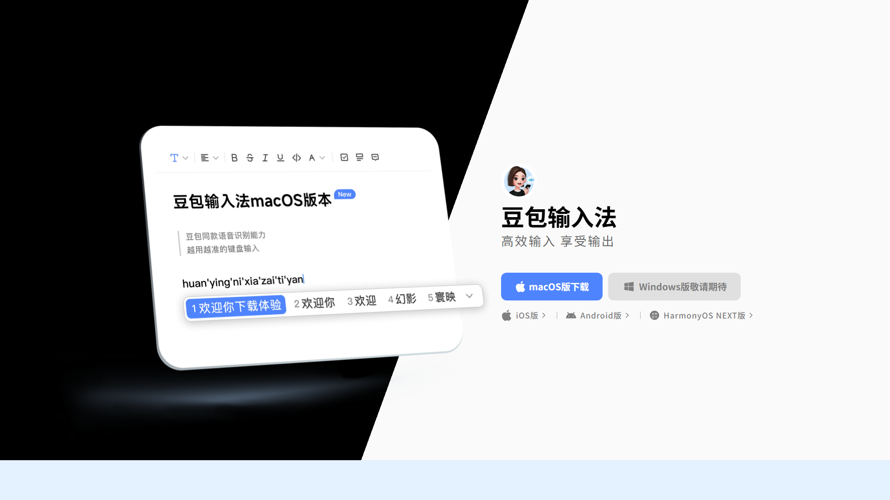
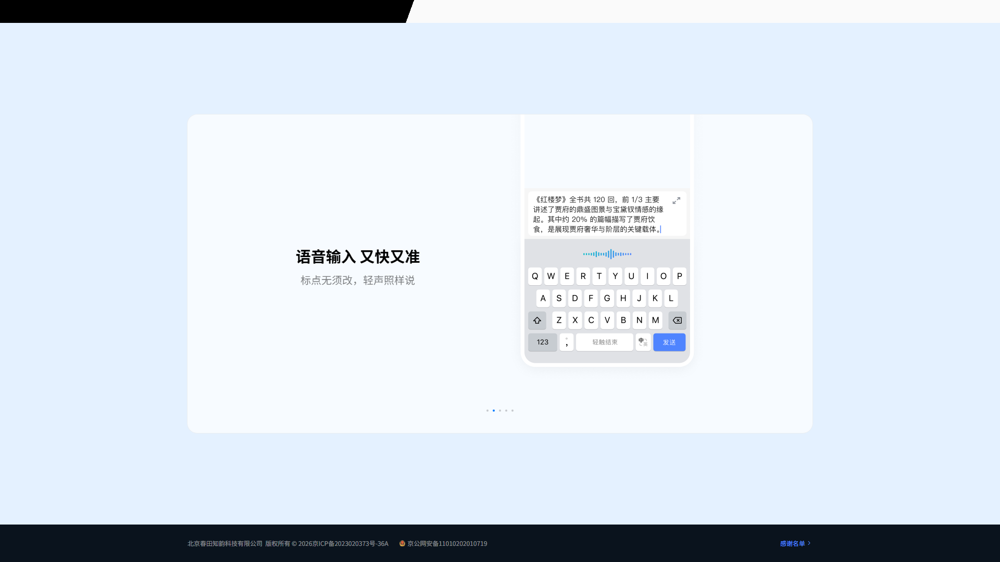
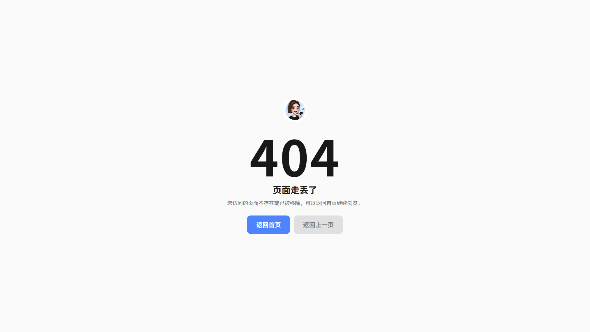
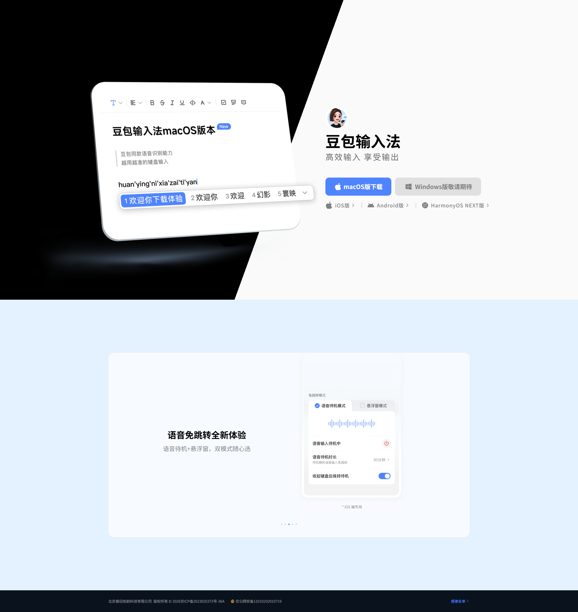

# DouBaoShuRUFa | SEO 站点

基于 **Django 6.1** 的 SEO 站点模板，完整还原豆包输入法官网 PC 端首页的视觉与交互，并支持服务端实时抓取官方数据、静态资源本地自托管、SEO 元信息与错误页配置。



## 项目特性

- **高保真页面还原**：Hero 主视觉（黑白斜切渐变）、特性轮播（Swiper，自动播放 / 分页点 / 横向滚轮）、扫码下载弹层、备案页脚，结构与样式同原站一致。
- **数据实时化**：`SpiderServices` 调用官网公开接口获取各平台下载链接与版本号，缓存 1 小时；接口异常时自动降级为本地快照，页面始终可渲染。
- **rem 等比自适应**：设计稿 1920 / 基准 16px，全窗口区间等比缩放，**任何宽度都不产生横向滚动条**（首屏内联脚本 + DOM 就绪后二次校正，规避纵向滚动条导致的宽度误差）。
- **品牌化错误页**：404 / 500 与首页同色系、同组件（品牌 Logo、主色按钮、站点底色），内置「返回首页 / 返回上一页」引导，不再出现空白页。
- **SEO 就绪**：模板内置 `title / keywords / description / canonical / og` 区块；`robots.txt` 动态输出 sitemap 地址；`sitemap.xml` 支持静态 URL + 动态 URL 并带 6 小时缓存。
- **配置与资源安全**：密钥、调试开关、跨域、媒体目录均由 `.env` 控制；页面所需的 CSS / JS / 图片全部本地化，不依赖外部 CDN。
- **可插拔扩展位**：`SpiderServices/`（数据抓取）、`middlewares/`（中间件，如外链替换为友情链接）已预留目录。

## 页面预览

| 首页首屏 | 特性轮播 |
| :---: | :---: |
|  |  |

| 扫码下载弹层 | 404 错误页（品牌化，非空白） |
| :---: | :---: |
|  |  |

<details>
<summary>首页整页长图（点击展开）</summary>



</details>

## 技术栈

| 类别 | 选型 |
| --- | --- |
| 后端 | Python 3.14、Django 6.1.1 |
| 依赖 | `requests`、`lxml`、`pycryptodome`、`python-dotenv`、`django-cors-headers` |
| 前端 | 源站编译 CSS（Tailwind 产物）、Swiper 11、qrcode.js |

## 目录结构

```
DouBaoShuRUFa/
├── DouBaoShuRUFa/          # 项目配置：settings / urls / wsgi / asgi
├── Web/                    # 唯一应用
│   ├── views/              # 视图与路由（index / 404 / 500 / sitemap）
│   ├── templates/          # 模板：母版 template.html + 页面 + 公共片段 + robots.txt
│   └── static/             # 本地化资源：css / js / images
├── SpiderServices/         # 数据抓取服务（官网接口 + 缓存 + 快照降级）
├── middlewares/            # 中间件扩展位（预留）
├── media/                  # 媒体文件（favicon 等）
└── docs/screenshots/       # README 截图
```

## 快速开始

```powershell
# 1. 创建并激活虚拟环境
python -m venv .venv
.\.venv\Scripts\Activate.ps1

# 2. 安装依赖
pip install -r requirements.txt

# 3. 配置环境变量（复制为 .env 后按需修改）
copy .env.example .env

# 4. 启动服务
python manage.py runserver 127.0.0.1:8000
```

浏览器访问 <http://127.0.0.1:8000/> 即可。

> `DEBUG=False` 时 Django 会缓存已加载的模板，修改模板 / 新增静态文件后需要**重启服务**才能生效。

## 环境变量

在项目根目录创建 `.env`（已在 `.gitignore` 中忽略）：

| 变量 | 说明 | 示例 |
| --- | --- | --- |
| `SECRET_KEY` | Django 签名密钥 | `django-insecure-xxx` |
| `DEBUG` | 调试模式，`True` 时展示详细错误页 | `False` |
| `ALLOWED_HOSTS` | 允许访问的域名，逗号分隔；上线必须修改 | `127.0.0.1` |
| `CORS_ORIGIN_ALLOW_ALL` | 是否允许所有跨域来源 | `True` |
| `XIAOYING_API_BASE` | 小影 API 基础地址（友情链接功能） | `https://xiaoyingapi.com` |
| `XIAOYING_API_APPID` / `XIAOYING_API_APPSECRET` | 小影 API 凭据 | `app_1` / `sk_1` |
| `FRIEND_LINK_REPLACE` | 外链替换为友情链接开关（`on` / `off`） | `off` |

## 数据源与降级策略

`SpiderServices/doubao.py` 负责首页数据：

- **实时接口**：`GET https://shurufa.doubao.com/api/v1/app/download_url?platform={macos|windows|ios|android|harmony}`，返回各平台安装包直链与版本号。
- **缓存**：结果缓存 1 小时（`cache` 框架，默认本地内存缓存）。
- **降级**：请求失败、超时或返回异常时，自动使用模块内的 `SNAPSHOT_DOWNLOADS` 快照，页面不报错、不空白。
- **二维码内容**：iOS / Android 指向移动端落地页，HarmonyOS 指向华为应用市场链接。

`SpiderServices/friend_links.py` 负责全站友情链接：

- **实时接口**：`GET {XIAOYING_API_BASE}/api/seo/friend_links`，携带 `app_id` / `timestamp` / `nonce` / `sign`（HMAC-SHA256）公共参数。
- **服务端渲染（SSR）**：通过 `Web/context_processors.friend_links` 上下文处理器注入到每一个页面，搜索引擎直接可见，**无需前端再发起 API 请求**；区块经 `Web/templates/common_html/friend_links.html`（被页脚包含）渲染在所有页面底部。
- **缓存与降级**：结果缓存 1 小时；接口未配置、调用失败或签名异常时自动降级为空（页面不报错、不空白）。

如需接入其它数据源，在该目录下新增模块并在视图中调用即可，视图层已有 `try/except` 兜底。

## 自定义与扩展

- **修改页面文案 / 图片**：编辑 `Web/templates/index.html`（结构）与 `SpiderServices/doubao.py`（轮播、页脚数据）。
- **新增页面**：新建模板并 ``，在 `Web/views/urls.py` 中注册路由即可复用母版的 SEO 区块与公共片段。
- **调整 SEO 信息**：在页面模板中覆盖 `title` / `keywords` / `description` / `canonical` 区块。
- **补充 sitemap**：在 `Web/views/request.py` 的 `SITEMAP_STATIC_URLS` 中追加固定 URL，或扩展 `sitemap` 视图接入动态数据。
- **设计稿宽度**：若改版为其它设计稿宽度，需同步修改 `index.html` 中内联脚本的 `DESIGN_WIDTH`。
- **错误页文案**：直接编辑 `Web/templates/404.html` 与 `500.html`；两者结构与类名一致，改动一处记得同步另一处。大号状态码字号由 `doubao-pc.css` 中的 `.error-code` 控制。

## 常见问题

**Q：页面出现左右滚动条？**
A：已修复。原因是首屏脚本执行时纵向滚动条尚未生成，根字号偏大导致内容超出视口。现在会在 DOM 就绪与资源加载后按最终视口宽度复核校正。若仍出现，请确认浏览器未缓存旧版 `doubao-pc.js`（模板已带 `?v=` 版本号）。

**Q：修改了 CSS / JS 但页面没变化？**
A：浏览器缓存导致。静态文件未启用哈希命名，请强制刷新（`Ctrl + F5`），或按上文方式在引用处追加版本号。

**Q：部署到服务器后报 `DisallowedHost`？**
A：在 `.env` 的 `ALLOWED_HOSTS` 中填入实际域名（多个用逗号分隔）。

**Q：静态文件 404？**
A：`DEBUG=False` 时由 `DouBaoShuRUFa/urls.py` 中的 `serve` 路由直接提供 `static/` 与 `media/`；生产环境建议交由 Nginx 等 Web 服务器处理，并将 `STATIC_ROOT` 与源目录分离。

## 免责声明

本项目仅用于技术学习与研究。页面文案、图片、商标、备案信息等相关权益归原权利人所有，请勿直接用于商业用途；部署上线前请替换为自有内容与合规信息。

## 联系

微信：duyanbz

